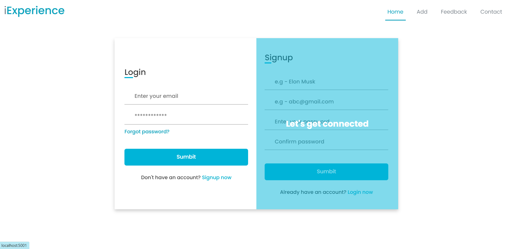

# Interview-Experience
- Platform where user can search for interview experience of students.
- Students can also add their interview experience on this site.
- This platform help students to get interview experiences of students.
            
            
            
## Technologies Used
1.  NodeJS
2.  Express
3.  HBS
4.  MYSQL

## Prerequisites
- Git
- NodeJS
- CLI
- GitHub
- Screenshots:

